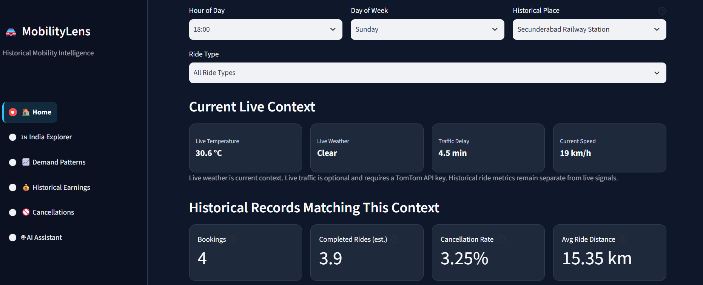
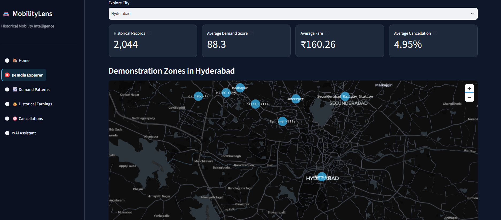
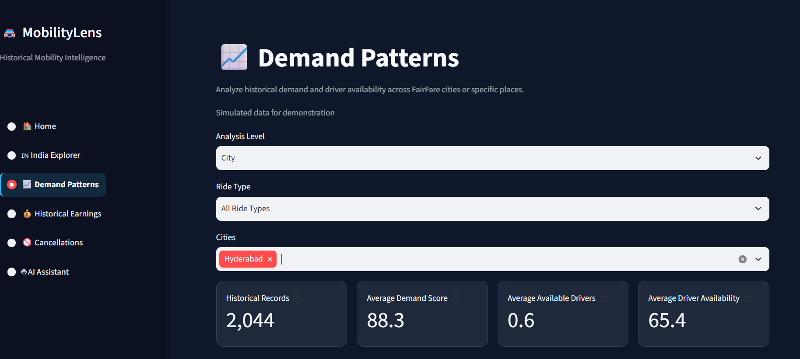
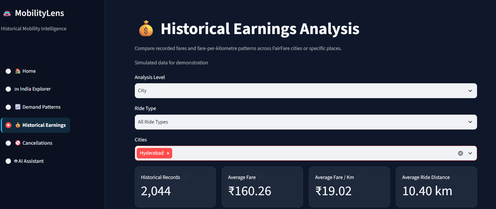
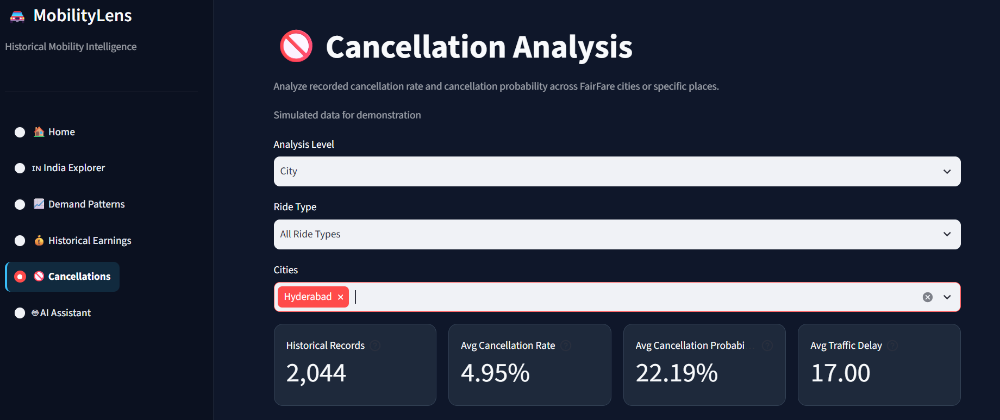
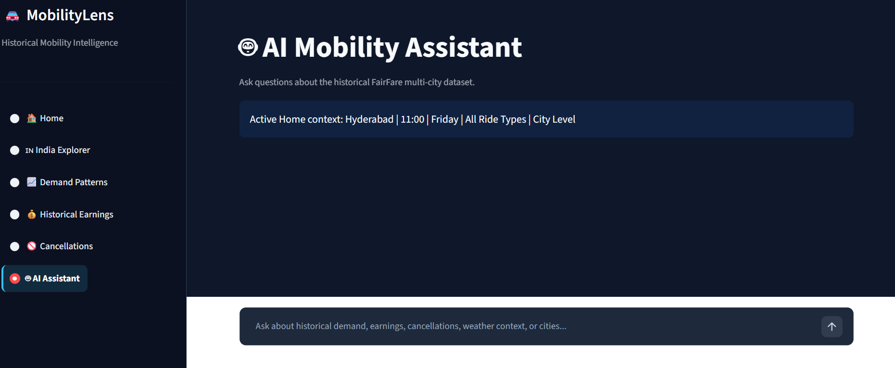

# 🚕 MobilityLens — Ride Demand, Fare & Cancellation Analytics with a Generative AI Assistant


**MobilityLens** is an **AI + Data Analytics web application** for exploring historical ride-demand, fare, cancellation, driver availability, and city-level mobility patterns using synthetic/demo ride-hailing data.

---

## 📌 Project Overview

Ride-hailing businesses need to understand how demand, fares, driver availability, cancellations, weather, traffic, and location patterns vary across different mobility situations.

MobilityLens provides an interactive application where users can explore these patterns through multiple analytical pages and use a **Generative AI assistant** to explain the calculated historical results.

The core principle of the application is:

**Data → Python/SQL Analytics → Interactive Dashboard → Gemini Explanation**

Python and analytical logic calculate the metrics. Gemini does **not** replace the analytical calculations; it explains the evidence produced by the application.

---

## 💼 Business Problem

Ride-hailing businesses need to understand:

- When and where historical ride demand is higher or lower
- How driver availability relates to historical demand
- How ride distance and ride type relate to fares
- How cancellation rates vary across cities and places
- How historical weather and event information appears alongside mobility data
- How mobility patterns differ across supported cities
- How current weather and traffic can provide additional context for a selected city

MobilityLens brings these factors together in one application so users can explore historical mobility patterns and understand the factors associated with them.

---

## 🎯 Business Impact

MobilityLens demonstrates how historical mobility data can support analysis of:

- **Demand:** Explore periods and locations with different levels of historical demand.
- **Driver Availability:** Examine available drivers alongside demand.
- **Pricing:** Compare fares, ride distances, and fare-per-kilometre across ride types and locations.
- **Cancellations:** Compare historical cancellation patterns across cities and places.
- **External Context:** View weather and event information alongside mobility analysis.
- **Location Analysis:** Explore city-level and selected-place mobility patterns.
- **Decision Support:** Use Generative AI to turn calculated analytical evidence into concise business explanations.

---

## 📊 Key Historical Metrics

The application works with historical ride-level records containing variables such as:


| Metric              | Description                              |
| ------------------- | ---------------------------------------- |
| Demand Score        | Historical demand indicator              |
| Available Drivers   | Number of available drivers              |
| Ride Distance       | Trip distance in kilometres              |
| Final Fare          | Historical ride fare                     |
| Fare per KM         | Calculated fare divided by ride distance |
| Cancellation Rate   | Historical cancellation rate             |
| Traffic Delay       | Recorded historical traffic delay        |
| Driver Availability | Historical driver availability measure   |
| Weather             | Recorded historical weather category     |
| Event               | Recorded historical event information    |


---

## 🖥️ Application Pages

### 🏠 Home

The Home page provides a context-specific starting point for exploring mobility data.

It can:

- Identify the visitor's approximate city when available
- Show historical mobility context
- Filter historical records by location, hour, and weekday where applicable
- Display historical demand, fare, distance, and cancellation information
- Show current weather context
- Show live traffic context when the external traffic service is available
- Provide a concise AI-generated summary of the historical evidence

The Home page uses a **demo-zone concept** for selected-place exploration. These zones should not be interpreted as official neighbourhood boundaries.

---

### 🇮🇳 India Explorer

The India Explorer provides a broader city-level comparison across the supported cities in the dataset.

It allows users to explore historical mobility patterns across cities and compare metrics such as:

- Demand
- Fares
- Ride distance
- Driver availability
- Cancellations
- Ride types

This page is intended for **city-level historical comparison**, rather than real-time operational monitoring.

---

### 📈 Demand Patterns

The Demand Patterns page focuses on historical demand behaviour.

Users can explore demand using dimensions such as:

- City
- Place
- Hour
- Weekday
- Ride type
- Demand level

The purpose is to identify historical demand patterns rather than predict future demand.

---

### 💰 Historical Earnings

The Historical Earnings page examines historical fare and earnings-related metrics.

Users can analyze:

- Average fare
- Average fare per kilometre
- Average ride distance
- Ride type
- City
- Selected place

This helps demonstrate how fare and trip characteristics can be examined from historical ride records.

---

### ❌ Cancellations

The Cancellations page focuses on historical cancellation behaviour.

Users can compare cancellation patterns by:

- City
- Selected place
- Ride type

The page is intended for historical comparison and does not currently provide a full hourly cancellation trend analysis.

---

### 🤖 AI Assistant

MobilityLens includes a **Google Gemini Generative AI assistant**.

The assistant receives analytical evidence calculated by the application and converts it into concise natural-language explanations.

For example, it can explain:

- Whether a selected place is above or below the city average
- Whether historical cancellation rates are relatively higher or lower
- How historical demand compares with a city benchmark
- How fare-per-kilometre compares with the available benchmark

### How the AI works

```text
Historical Ride Data
        ↓
Data Cleaning & Transformation
        ↓
Python / Analytical Calculations
        ↓
Historical Metrics & Comparisons
        ↓
Gemini Generative AI
        ↓
Natural-Language Explanation

```

### Important distinction

MobilityLens is **not an autonomous AI agent**.

The application does not ask Gemini to independently perform the entire analysis.

Instead:

> **Python/analytics calculates the numbers → Gemini explains the calculated evidence.**

This makes the AI component transparent and easier to validate.

---

## 🌦️ Current Weather Context

MobilityLens can retrieve current weather information through the **Open-Meteo API**.

Current weather is used as **context**, not as historical ride evidence.

For example:

```text
Current Weather
       ↓
Context for the selected city
       ↓
Displayed alongside historical analytics

```

The application does not claim that current weather caused the historical ride patterns.

---

## 🚦 Live Traffic Context

MobilityLens includes optional integration with the **TomTom Traffic API**.

When the traffic service and API credentials are available, the application can display current traffic context such as:

- Traffic delay
- Current speed

Live traffic is separate from the historical ride dataset.

> **Live traffic is displayed where the external traffic service is available and responding successfully.**

A traffic API failure does not prevent the historical analytics pages from working.

---

## 🗄️ Data & Database

The project uses a synthetic/demo ride-hailing dataset containing historical mobility records.

The application includes SQLite database creation and database-query functions as part of the project architecture.

However, the current application also contains a **database availability check**. When the required SQL functions are not available through that check, the analytical pages fall back to the Pandas-based implementation.

Therefore, the project should not be described as a fully SQL-driven dashboard.

A more accurate description is:

> **Python/Pandas-based historical analytics application with SQLite database support and SQL query infrastructure.**

---

## 🧹 Data Preparation

The application performs preprocessing before analysis, including:

- Cleaning text fields
- Converting numeric columns
- Handling missing event information
- Validating coordinate values
- Calculating derived metrics
- Assigning records to demonstration zones where applicable
- Converting cancellation rates into percentage representations when required
- Creating fare-per-kilometre calculations
- Normalising demand-level categories when necessary

Example derived metric:

```text
Fare per KM = Final Fare / Ride Distance

```

The calculations are performed from the historical records rather than being generated by the AI assistant.

---

## 🧭 Location Analysis

MobilityLens uses two different location concepts:

### Home

The Home page uses the visitor's approximate/current city context when available.

### India Explorer

India Explorer provides supported-city comparison.

### Selected Places

Selected places use demonstration-zone data where applicable.

These zones are intended for portfolio demonstration and should not be interpreted as official geographic or administrative boundaries.

---

## 🏗️ Application Architecture

```text
                    ┌──────────────────────┐
                    │ Historical CSV Data  │
                    └──────────┬───────────┘
                               │
                               ▼
                    ┌──────────────────────┐
                    │ Data Preparation     │
                    │ Python / Pandas      │
                    └──────────┬───────────┘
                               │
                  ┌────────────┴────────────┐
                  ▼                         ▼
        ┌──────────────────┐      ┌──────────────────┐
        │ Analytical Logic │      │ SQLite Database  │
        │ Python / Pandas  │      │ / SQL Support    │
        └────────┬─────────┘      └────────┬─────────┘
                 │                         │
                 └────────────┬────────────┘
                              ▼
                   ┌──────────────────────┐
                   │ Streamlit Application│
                   └──────────┬───────────┘
                              │
            ┌─────────────────┼─────────────────┐
            ▼                 ▼                 ▼
       Dashboard          APIs             Gemini
       Analytics       Weather/Traffic    AI Assistant
            │                 │                 │
            └─────────────────┴─────────────────┘
                              ▼
                   Natural-Language Insights

```

---

## 🛠️ Technology Stack


| Technology                       | Purpose                             |
| -------------------------------- | ----------------------------------- |
| Python                           | Application and analytical logic    |
| Pandas                           | Data cleaning and analysis          |
| NumPy                            | Numerical operations                |
| Streamlit                        | Interactive web application         |
| SQLite                           | Local database support              |
| SQL                              | Database query infrastructure       |
| Google Gemini                    | Generative AI explanations          |
| Open-Meteo API                   | Current weather context             |
| TomTom Traffic API               | Optional live traffic context       |
| Git & GitHub                     | Version control and project hosting |
| Streamlit Cloud                  | Application deployment              |
| Cursor / AI-assisted development | Development support                 |


---

## 📁 Project Structure

```text
mobilitylens/
│
├── data/
│   ├── fairfare_ride_demand_dataset.csv
│   └── mobilitylens_zones.csv
│
├── Screenshots/
│   ├── ai-assistant.png
│   ├── cancellations.png
│   ├── demand-patterns.png
│   ├── historical-earnings.png
│   ├── home.png
│   └── india-explorer.png
│
├── app.py
├── database.py
├── create_database.py
├── requirements.txt
├── README.md
├── .gitignore
└── .env.example

```

---

## ⚙️ Installation

Clone the repository and move into the project directory:

```bash
git clone https://github.com/avinashreddy-da/mobilitylens.git
cd mobilitylens
cd mobilitylens

```

Create a virtual environment:

```bash
python -m venv venv

```

Activate it on Windows:

```bash
venv\Scripts\activate

```

Install the required packages:

```bash
pip install -r requirements.txt

```

---

## 📦 Requirements

The application uses the following core dependencies:

```text
streamlit==1.64.0
pandas==3.0.6
numpy==2.5.3
requests==2.34.2
altair==6.3.0
python-dotenv==1.2.3
google-genai==2.27.0

```

---

## 🔐 Environment Variables

Create a local `.env` file for API credentials.

Example:

```env
GEMINI_API_KEY=your_gemini_api_key
TOMTOM_API_KEY=your_tomtom_api_key
RIDEINTEL_CITY=Hyderabad

```

**Never commit real API keys to GitHub.**

The `.env` file is excluded through `.gitignore`.

For Streamlit Cloud, API credentials should be stored through the application's **Secrets** configuration rather than committed to the repository.

---

## ▶️ Run the Application

Start the Streamlit application with:

```bash
streamlit run app.py

```

The application will open in your browser.

---

## ☁️ Deployment

MobilityLens is designed for deployment using **Streamlit Cloud**.

The deployment requires:

1. A GitHub repository
2. The project files
3. `requirements.txt`
4. Streamlit Cloud Secrets for API credentials
5. `app.py` as the application entry point

The application can continue to provide historical analytics even when optional external APIs are unavailable.

---

## 📸 Screenshots

### Home



### India Explorer



### Demand Patterns



### Historical Earnings



### Cancellations



### AI Assistant



---

## ⚠️ Limitations

MobilityLens is a portfolio and demonstration project, so several limitations should be considered.

### Synthetic Data

The historical ride dataset is synthetic/generated data and should not be interpreted as real operational data from a ride-hailing company.

### Historical Analysis

The main analytical pages describe historical records. They are not production forecasting or real-time demand prediction systems.

### AI

Gemini is used as a **Generative AI explanation layer**.

It does not independently calculate the underlying business metrics.

### Traffic

Live traffic depends on an external TomTom API and may be unavailable if the service or API credentials do not respond successfully.

### Weather

Current weather is contextual information and should not be interpreted as historical weather for individual rides.

### Events

Event information comes from the available dataset and should not be interpreted as a complete real-world event calendar.

### Geographic Zones

Demonstration zones are portfolio-oriented geographic references and are not official neighbourhood boundaries.

### Database

SQLite support is included in the architecture, but the application's analytical pages can fall back to Pandas when the required SQL-query availability checks are not satisfied.

---

## 🚀 Future Improvements

Potential improvements include:

- Add more robust SQL coverage across all analytical pages
- Add richer time-based cancellation analysis
- Add stronger weather-versus-demand comparisons
- Add more detailed event analysis
- Improve real-time traffic integration
- Add demand forecasting models
- Add predictive cancellation modelling
- Add more city and zone coverage
- Add automated data-refresh pipelines
- Add stronger validation and monitoring for external APIs
- Add production-scale database support

---

## 🎓 Skills Demonstrated

This project demonstrates practical experience with:

- Python
- Pandas
- NumPy
- SQL
- SQLite
- Data cleaning
- Exploratory data analysis
- Business analytics
- KPI development
- Streamlit
- API integration
- Generative AI
- Prompt design
- Data storytelling
- Git & GitHub
- Cloud deployment

---

## 💡 Key Takeaway

MobilityLens demonstrates an end-to-end approach to building a modern analytics application:

```text
Business Problem
      ↓
Historical Data
      ↓
Data Cleaning
      ↓
Analytical Metrics
      ↓
Interactive Dashboard
      ↓
External Context APIs
      ↓
Generative AI Explanation
      ↓
Business Insight

```

The main analytical work is performed through **Python/Pandas and SQL/database infrastructure**, while **Gemini Generative AI helps explain the calculated evidence in natural language**.

This makes MobilityLens an **analytics-first application with a practical Generative AI layer**, rather than an AI system that replaces the underlying analysis.

---

## 👨‍💻 Author

**Avinash Reddy**

MSc Statistics | Data Analyst Aspirant

Skills: Python • SQL • Pandas • Power BI • Excel • Statistics • Streamlit • Generative AI

---

## ⭐ Project Positioning

**MobilityLens — Ride Demand, Fare & Cancellation Analytics with a Generative AI Assistant**

A portfolio project demonstrating how **data analytics + APIs + Generative AI** can be combined into an interactive business analytics application.
